<h1>Olá! &#x1F44B;&#x1F604;</h1>

Um pouquinho sobre mim:

    🎓 Graduações: Gestão da Informação e Análise e Desenvolvimento de Sistemas;
    🔬 Meta: Iniciar especialização em Inteligência Artificial ou alguma área correlata à Ciência de Dados;
    🔭 Objetivo: Mestrado em uma das minhas áreas de interesse;
    🤖 Áreas de interesse: Ciência de Dados, Inteligência Artificial, Machine Learning, Desenvolvimento de Software;
    📑 Procurando sempre se atualizar com relação ao já aprendido;
    📚 Sempre disposto a aprender;
    🎼 Hobbies: Música e Astronomia.

<h2>&#x1F4C8; Meus <em>status</em> no GitHub</h2>

    
    

<h2>&#x1F4BB;&#x1F527; Tecnologias & Ferramentas</h2>
Abaixo algumas tecnologias com as quais já tive contato e as ferramentas que costumo utilizar.
 

<h5>&#x27A1; Linguagens</h5>

    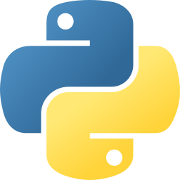
    
    
    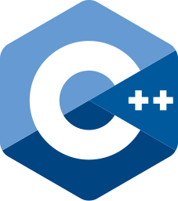
    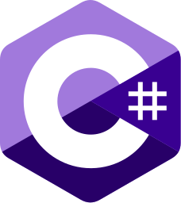
    
    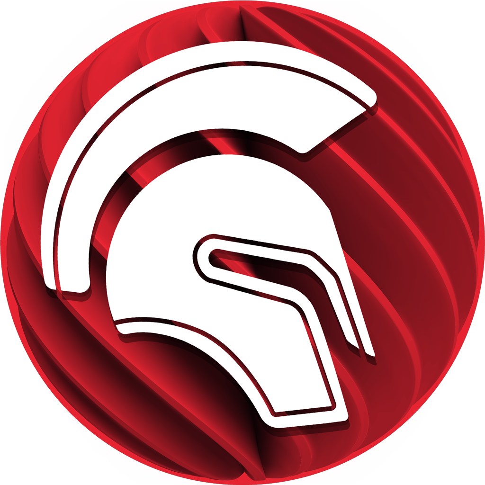
    
    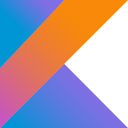
    
    
    
    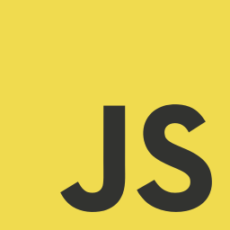
    
    

<h5>&#x27A1; Frameworks / Bibliotecas / Gerenciadores de pacotes / etc.</h5>

    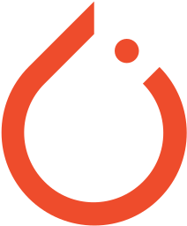
    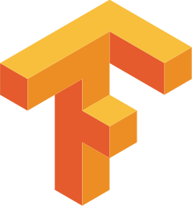
    
    
    
    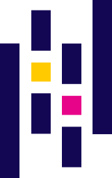
    
    
    
    
    
    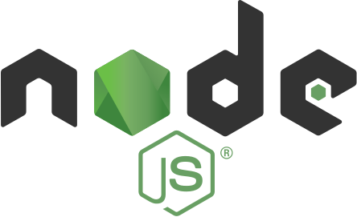
    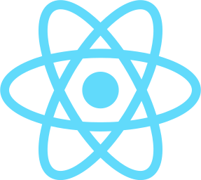
    
    
    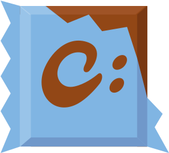

    
    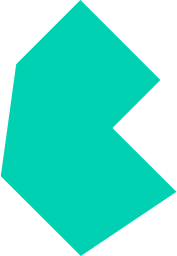

<h5>&#x27A1; DevOps / CI-CD</h5>

    
    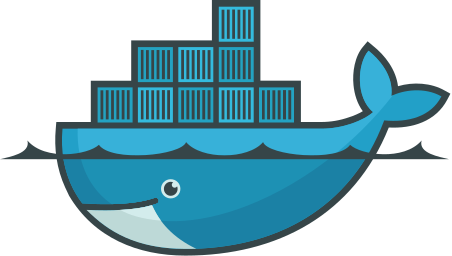
    
    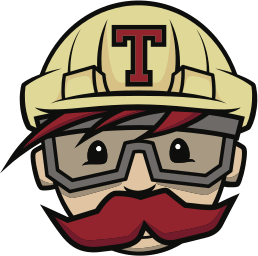
    

<h5>&#x27A1; Testes / Monitoramento</h5>

    
    
    
    
    

<h5>&#x27A1; Bancos de Dados / Data Warehouse / Big Data</h5>

    
    
    
    
    
    
    

<h5>&#x27A1; Servidores</h5>

    
    

<h5>&#x27A1; Sistemas Operacionais</h5>

    
    
    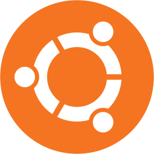
    
    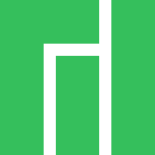
    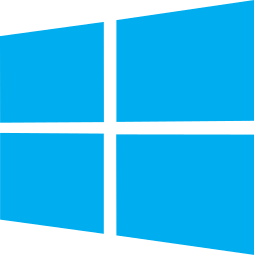

<h5>&#x27A1; IDEs</h5>

    
    
    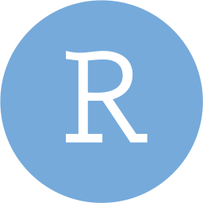
    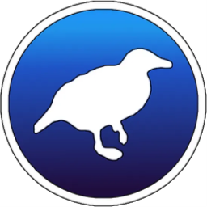
    
    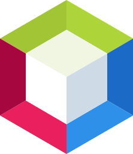
    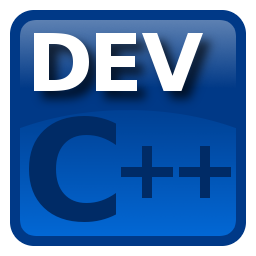
    
    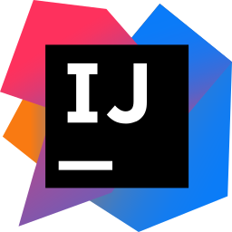
    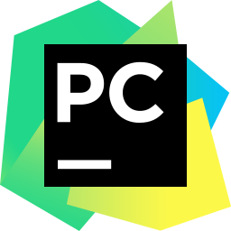
    
    

<h5>&#x27A1; Repositórios / Versionamento</h5>

    
    
    

<h5>&#x1F468;&#x200D;&#x1F4BB; Ferramentas mais utilizadas</h5>

   

