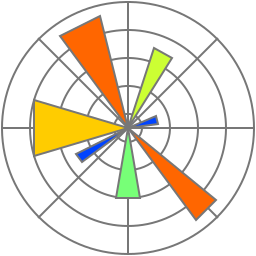
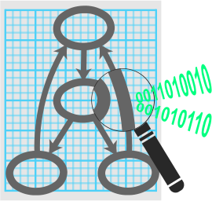
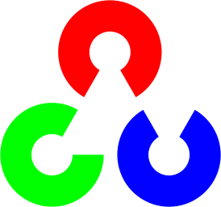
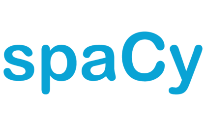
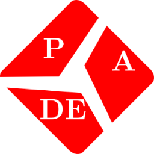
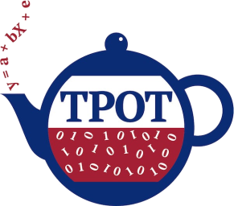
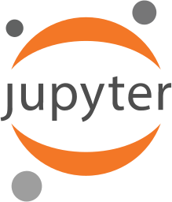
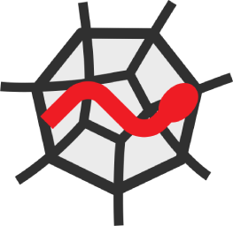
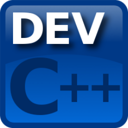

# Olá! &#x1F44B;&#x1F604;

Um pouquinho sobre mim:

    🎓 Graduações: Gestão da Informação e Análise e Desenvolvimento de Sistemas;
    ✍🏻 Especialização: Inteligência Artificial Aplicada (quase terminando), MBA em Ciências de Dados (no início);
    🔬 Meta: Terminar minha especialização;
    🔭 Objetivo: Mestrado em uma das minhas áreas de interesse;
    🤖 Áreas de interesse: Ciência de Dados, Inteligência Artificial, Machine Learning, Desenvolvimento de Software;
    📑 Procurando sempre se atualizar com relação ao já aprendido;
    📚 Sempre disposto a aprender;
    🎼 Hobbies: Música e Astronomia.

---

## &#x1F4C8; Meus *status* no GitHub

---

## &#x1F4BB;&#x1F527; Tecnologias & Ferramentas

Abaixo algumas tecnologias com as quais já tive contato e as ferramentas que costumo utilizar.

### &#x27A1; Linguagens

                

### &#x27A1; Frameworks / Bibliotecas / Gerenciadores de pacotes

#### &#x25AA; Ciência de Dados / Inteligência Artificial

                          

#### &#x25AA; Desenvolvimento

            

### &#x27A1; DevOps / CI-CD

    

### &#x27A1; Testes / Monitoramento

    

### &#x27A1; Bancos de Dados / Data Warehouse / Big Data

      

### &#x27A1; Servidores

 

### &#x27A1; Sistemas Operacionais

       

### &#x27A1; IDEs

               

### &#x27A1; Repositórios / Versionamento

  

### &#x1F468;&#x200D;&#x1F4BB; Ferramentas mais utilizadas

   

---
